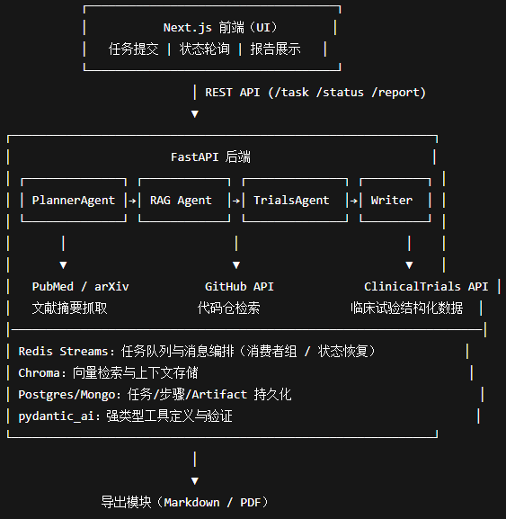

# Medical-AI-TechRadar
Medical AI TechRadar + Trials Enricher面向offer的医疗人工智能技术雷达 + 试验增强器
## 🎯 目标（Goal）

构建一个 医疗方向的 Agentic RAG 系统 ——
输入「病种 / 模态 / 任务」（如 CT 肺结节分割），自动完成：

三路信息汇总：文献（PubMed / arXiv）、开源代码（GitHub）、临床试验（ClinicalTrials.gov）

事实校验与引用报告生成：以多源交叉验证方式输出可引用的 Markdown / PDF 报告

Agent 执行轨迹可视化：展示计划树、工具调用链、引用高亮与生成时间线

项目聚焦 公开数据 + 工程化能力展示，不涉及私有/隐私数据与微调。

## 架构    


🗓️ 里程碑（Milestones）
| 阶段                       | 时间                      | 主要目标                                                                                     |
| ------------------------ | ----------------------- | ---------------------------------------------------------------------------------------- |
| **阶段 1：最小闭环**       | 2025-11-07 → 2025-12-05 | 建立 FastAPI + Chroma + 基础 Agent，接入 PubMed / arXiv / GitHub / Trials，输出最小报告（MD→PDF），端到端跑通。 |
| **阶段 2：多 Agent 编排与可观测性** | 2025-12-08 → 2026-01-09 | 引入 Redis Streams、多 Agent 协作、状态恢复、异步并发、指标导出与前端展示（计划树/时间线/引用高亮）。                           |
| **阶段 3：性能评估与演示打磨**       | 2026-01-12 → 2026-01-30 | 完善评估体系（工具成功率、引用可用率、事实一致性）、优化稳定性、封装 docker-compose、一键部署与“面试包”交付。                          |

## 📁 项目结构

```bash
medical-ai-techradar
 ┣ api/              → FastAPI 接口层（/health, /task, /status, /report）
 ┣ app/
 ┃ ┣ core/           → 全局配置、日志、异常处理（pydantic-settings）
 ┃ ┣ models/         → Task / Step / Artifact / 枚举类型等数据模型
 ┃ ┣ store/          → 存储实现（memory → postgres/mongo）
 ┃ ┣ tools/          → Agent 工具模块（Search / Fetch / Trials / Export 等）
 ┃ ┣ agents/         → 多 Agent 子模块（planner / crawler / rag / writer 等）
 ┃ ┣ orchestrator/   → 调度器（Redis Streams、状态机、消费者组）
 ┃ ┣ memory/         → 任务与事实记忆（SummaryBuffer / 向量缓存）
 ┃ ┣ eval/           → 指标评估与 /metrics 导出
 ┃ ┗ ui/             → Next.js 前端（最小演示界面）
 ┣ tests/            → 单元与集成测试（pytest）
 ┣ docker-compose.yml→ 一键启动各服务（api/chroma/redis/ui）
 ┣ requirements.txt  → Python 依赖列表
 ┣ .env.example      → 环境变量示例
 ┗ README.md         → 项目说明文档


## 目录结构
medical-ai-techradar/
├── api/                            # FastAPI 路由层（REST 接口）
│   ├── main.py                     # 应用入口，定义 /health 等路由
│   ├── routes/                     # 后续分模块接口（task/status/report 等）
│   │   ├── task.py
│   │   ├── status.py
│   │   └── report.py
│   └── deps.py                     # 依赖注入与全局异常、日志钩子
│
├── app/                            # 核心逻辑层（配置 / 模型 / 工具 / 存储）
│   ├── core/
│   │   ├── config.py               # 全局配置（pydantic-settings）
│   │   ├── logging.py              # 日志格式定义（后续补）
│   │   └── exceptions.py           # 全局异常（后续补）
│   │
│   ├── models/                     # Pydantic 数据模型
│   │   ├── base.py                 # 公共字段与时间戳
│   │   ├── enums.py                # 枚举类型（TaskState、ArtifactType 等）
│   │   ├── task.py                 # Task / Step / TaskCreate 定义
│   │   └── artifact.py             # Artifact 定义
│   │
│   ├── store/                      # 存储层
│   │   ├── memory.py               # 临时内存存储（后续替换为数据库）
│   │   ├── postgres.py             # PostgreSQL 实现（12月初加入）
│   │   └── mongo.py                # MongoDB 实现（可选）
│   │
│   ├── tools/                      # Agent 工具集合（Search/Fetch/Trials/Export 等）
│   │   ├── base.py
│   │   ├── search_tool.py
│   │   ├── fetch_tool.py
│   │   ├── trials_tool.py
│   │   ├── chart_tool.py
│   │   └── export_tool.py
│   │
│   ├── agents/                     # 多 Agent 模块（Planner / RAG / Writer 等）
│   │   ├── planner.py
│   │   ├── crawler.py
│   │   ├── rag.py
│   │   ├── trials.py
│   │   ├── analyst.py
│   │   └── writer.py
│   │
│   ├── orchestrator/               # 调度器（Redis Streams / 状态机 / 消费者组）
│   │   ├── orchestrator.py
│   │   └── state_machine.py
│   │
│   ├── memory/                     # 任务记忆（缓存 / SummaryBuffer / 向量记忆）
│   │   ├── memory.py
│   │   ├── summary_buffer.py
│   │   └── vector_memory.py
│   │
│   ├── eval/                       # 评估与指标（性能、事实一致性等）
│   │   ├── metrics.py
│   │   ├── evaluator.py
│   │   └── benchmarks/
│   │       └── baseline_topics.yaml
│   │
│   └── ui/                         # 前端 Next.js（单独容器挂载）
│       └── (placeholder)
│
├── docker-compose.yml              # 一键启动各服务（api / chroma / redis / ui）
├── requirements.txt                # Python 依赖
├── .env.example                    # 环境变量示例
├── README.md                       # 项目说明（架构 / 用法 / 日程）
└── tests/                          # 单元测试与集成测试
    ├── test_api_health.py
    ├── test_task_lifecycle.py
    └── conftest.py
```

## 举例
### 输入：
```bash
POST /task
{
  "topic": "CT 肺结节分割",
  "scope": "default",
  "depth": 1
}
```
### Agent 执行步骤（内部流程）
```bash
PlannerAgent
   ↓
CrawlerAgents（PubMed / arXiv / GitHub / Trials）
   ↓
RAG Agent（向量检索 + 重排 + 上下文汇总）
   ↓
AnalystAgent（多源一致性检查）
   ↓
WriterAgent（生成报告）
   ↓
ExportTool（导出 Markdown / PDF）
```
### 输出：
# CT 肺结节分割研究趋势（2023–2025）

## 摘要
近年来，基于 Transformer 的 3D 医学影像分割模型在肺结节检测任务中表现突出。
研究重点包括轻量化结构、跨模态特征融合与公开竞赛结果分析。

## 文献综述
1. [PubMed] Lung Nodule Segmentation with 3D Swin-UNETR (2024)  
2. [arXiv] Transformer-based Lesion Segmentation (2023)  

## 开源代码
| 仓库 | Star | 更新时间 | 模型结构 |
|------|------|-----------|----------|
| `3D-LungSeg` | ⭐ 460 | 2024-10 | SwinUNETR |
| `LIDC-SegNet` | ⭐ 190 | 2023-12 | 3D-UNet++ |

## 临床试验
| 试验编号 | 状态 | 样本量 | 地点 |
|-----------|--------|----------|------|
| NCT05678910 | Recruiting | 120 | 中国上海 |
| NCT06123456 | Completed | 86 | 美国波士顿 |

## 结论区 ✅
多项文献与试验结果表明，3D Transformer 架构在肺结节分割中准确率提升 5–10%，  
尤其在小结节检测上表现优越。

## 待核实区 ⚠️
部分试验结果尚未公布，样本规模较小，需进一步验证。

## 引用
[1] PubMed: doi:10.1016/j.media.2024.103915  
[2] arXiv: 2405.12345v1  
[3] GitHub: github.com/med-ai/3d-lungseg  
[4] ClinicalTrials.gov: NCT05678910

# 数据协议 JSON Schema
## Task
```bash
{
  "task_id": "task_9b12eac9d2e4",
  "topic": "CT 肺结节分割",
  "scope": "default",
  "depth": 1,
  "state": "RUNNING",
  "progress": 0.4,
  "steps": [
    {
      "step_id": "step_a13c",
      "name": "Planner",
      "state": "DONE",
      "message": "任务拆解完成",
      "meta": {"duration_s": 0.6}
    },
    {
      "step_id": "step_b41f",
      "name": "RAG",
      "state": "RUNNING",
      "message": "正在检索文献",
      "meta": {"current": 2, "total": 5}
    }
  ],
  "artifacts": ["artifact_73bd"],
  "timestamps": {
    "created_at": "2025-11-07T10:20:45Z",
    "updated_at": "2025-11-07T10:22:03Z"
  }
}
```
## Step
```bash
{
  "step_id": "step_a13c",
  "name": "Planner",
  "state": "DONE",
  "message": "任务拆解完成",
  "meta": {"duration_s": 0.6}
}
```

## Artifact
```bash
{
  "artifact_id": "artifact_73bd",
  "task_id": "task_9b12eac9d2e4",
  "type": "MARKDOWN",
  "mime": "text/markdown",
  "uri": "/artifact/task_9b12eac9d2e4/report.md",
  "inline": "# CT 肺结节分割报告\n...",
  "meta": {
    "size_kb": 12.4,
    "source_count": 18,
    "created_by": "WriterAgent"
  }
}
```